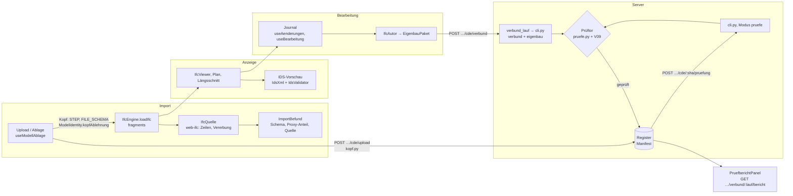

# CDE — Common Data Environment

Lieferungen (IFC) annehmen, prüfen, anzeigen, bearbeiten und zu einem geprüften
Verbund zusammenführen, nach ISO 19650 (WIP → Shared → Published → Archived).
Dieses README ist die Landkarte. Messwerte und das Prüftor stehen in
`backend/app/ifc/README.md`, die erzeugten Diagramme der genutzten IFC-Klassen,
Beziehungen und Prüfstufen in `docs/ifc/`.

## Datenfluss



Der Client **zeigt**, das Backend **urteilt**. Was im Browser geprüft wird
(Kopf, Import-Befund, IDS-Vorschau), ist Vorschau; das Urteil fällt im
Unterprozess `backend/app/ifc/cli.py` und steht im Register.

## Jedes Wissen an EINEM Ort

| Wissen | Ort | Spiegel und Wächter |
|---|---|---|
| IFC-Schema: Klassen, Vererbung, Attribute, PredefinedTypes, Where-Rules, Pset/Qto-Vorlagen | `backend/app/ifc/schema.py` + `daten/schema_IFC4X3_ADD2.json` | MCP-Server `ifc` liest dort |
| Client-Wörterbuch | `data/entity-schema.js`, `pset-templates.js`, `altnamen.js` — **erzeugt** (`python3 -m app.ifc.generiere_client`) | `test_client_woerterbuch.py`, Hook, pre-commit |
| Vererbung im Client | `services/bauform/Typprofile.js` (`vererbungskette`, `normalisiereKategorie`) | — |
| Fachliche Klassengruppen | `services/Kategorien.js` (Wurzeln linear, Schacht, Aushub) | `backend/app/ifc/kategorien.py`, `test_kategorien.py` |
| Import-Kopf: STEP, Schema, Einheit, Projekt-GlobalId | `backend/app/ifc/kopf.py` | `services/ModelIdentity.js`, Falltabelle `backend/app/ifc/tests/daten/kopf_faelle.json` |
| Was sperrt | `pruefe.offen` im Backend | `services/Pruefbericht.js`, Fixture `bericht_pruefe.json` |
| Statusübergänge, Prüfbericht vor WIP → Shared | `backend/app/api/projekt/core/cde.py` | `services/StatusWorkflow.js`, `test_cde.py` |
| Projektanforderungen | IDS 1.0: `backend/app/ifc/daten/quagg-starter.ids`, Büro-Schlüssel `ids:*`, Projekt-`.ids` | `data/quagg-starter.ids` (erzeugt), `idsVergleich.test.js` gegen ifctester |
| Herkunft erzeugter Elemente (`Quagg_Herkunft`, Dokumentverweise) | `backend/app/ifc/herkunft.py` | `test_herkunft.py`; IDS `spec-*-herkunft` |
| Erzeugte Container: Namensregel, Eignung, kein Verbund im Satz | `backend/app/api/projekt/core/cde.py` (`ERZEUGT_MUSTER`, `EIGNUNG`, `_satz_pruefen`) | `services/StatusWorkflow.js` (`EIGNUNG`, `test_cde.py` hält gleich), `services/Herkunft.js` (`istAbgabeContainer`, `teileRegister`, `regenerierbar`) |
| Bauwerksstruktur aller Modelle (Aushub unter dem Wirt, Gruppen) | `services/Bauwerksstruktur.js` | `bauwerksstruktur*.test.js`, `ifcSpatialWindow.test.js`, Fixture `backend/app/ifc/tests/daten/erdbau_vergleich.ifc` |

Fixtures, die beide Seiten teilen, liegen in `backend/app/ifc/tests/daten/` und
werden dort gelesen, nicht kopiert. Kein Feature importiert aus einem anderen
Feature.

## Ordner

- `views/CdeView.vue` — Register, Status, Verbund-Dialog, Prüfspalte, Prüfbericht.
- `components/` — Viewer, Panels, `PruefberichtPanel.vue`; Bausteine in `ui/` (Dialog, Icon, Panel).
- `services/` — reine Logik: Engine, Quelle, Autor, Paket, Kategorien, IDS, Prüfbericht, Herkunft, Bauwerksstruktur, dazu `bauform/`, `geometrie/`, `gelaende/`, `ableitung/`.
- `stores/` (Pinia), `composables/`, `styles/theme.css` (Tokens und Bausteine).
- `data/` — erzeugt, von Hand nur `fachbereiche.js`.
- `test/` — Vitest; echte Modelle `BIM26_*.ifc` und `IFCOUT_*.IFC` liegen hier.

## Testen

```bash
cd client && npx vitest run src/features/cde/test
```

Sechs Dateien werden übersprungen, wenn die StorageBox oder
`client/testdata-local/` fehlt. Nie `npm run build` zum Prüfen — der Build geht
live.
