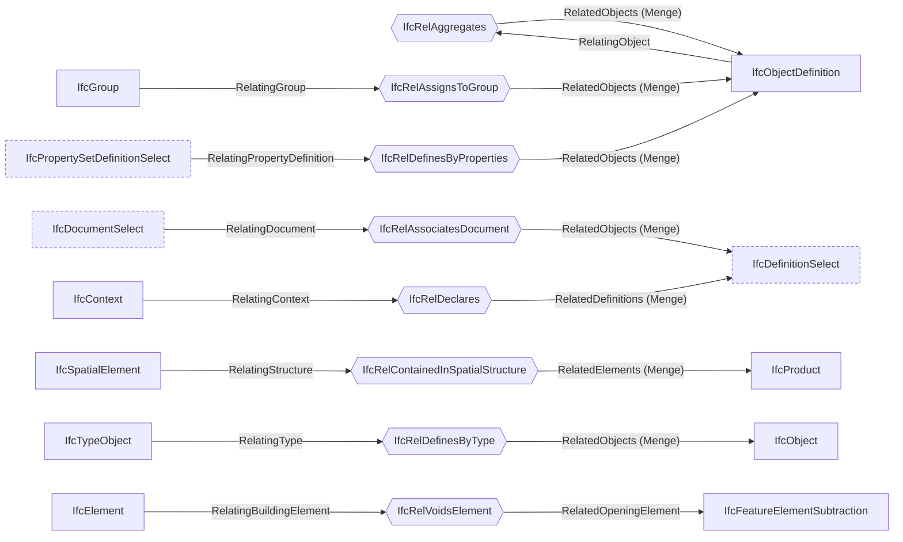

# Genutzte Beziehungen und Merkmalsätze

> Erzeugt von `backend/app/ifc/diagramme.py` aus dem Code und dem Schema-Schnappschuss (IFC4X3_ADD2, ifcopenshell 0.8.5). Nicht von Hand ändern — neu schreiben mit `cd backend && python3 -m app.ifc.diagramme`.

Sechseck: eine Beziehung, die die CDE schreibt. Pfeil hinein: das `Relating…`-Ende, Pfeil hinaus: das `Related…`-Ende. Gestrichelt: ein Auswahl-Typ (SELECT) statt einer Klasse.

## Quagg_*-Merkmalsätze

Eigene Merkmalsätze der CDE — kein bSI-Standard. Wo sie geschrieben oder gelesen werden:

| Merkmalsatz | Fundstellen |
|---|---|
| `Quagg_CDE` | `backend/app/ifc/eigenbau.py`, `backend/app/ifc/herkunft.py`, `client/src/features/cde/services/IdsXml.js` |
| `Quagg_Fachmodell` | `backend/app/ifc/herkunft.py`, `backend/app/ifc/verbund.py` |
| `Quagg_Georeferenz` | `backend/app/ifc/verbund.py` |
| `Quagg_Herkunft` | `backend/app/ifc/__init__.py`, `backend/app/ifc/eigenbau.py`, `backend/app/ifc/herkunft.py`, `backend/app/ifc/verbund.py` |
| `Quagg_Vorgang` | `backend/app/ifc/eigenbau.py` |
