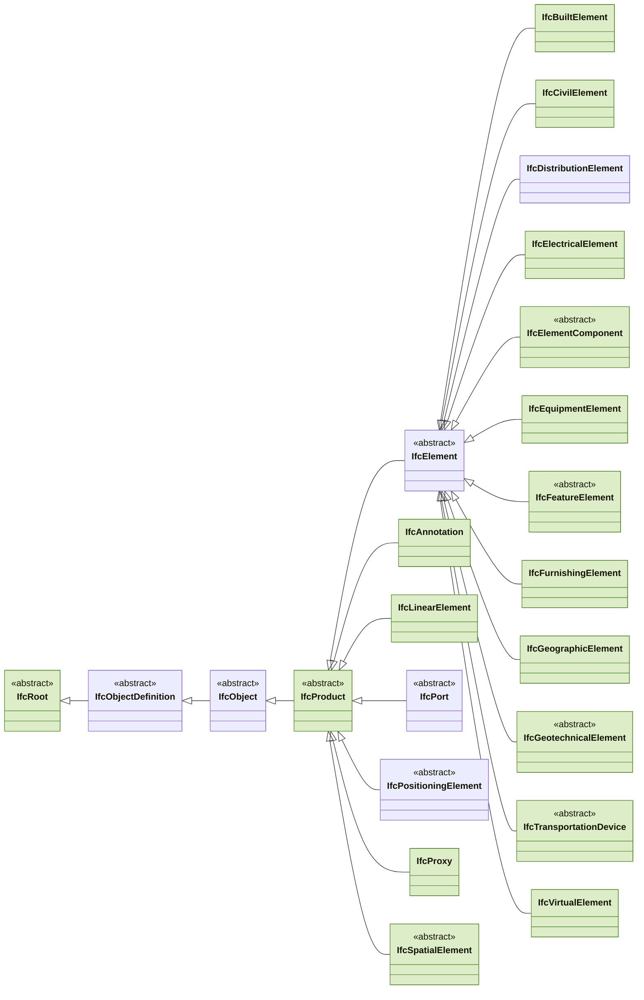
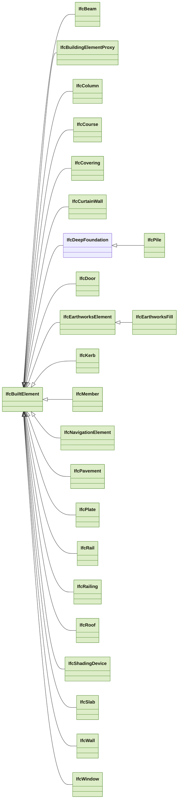
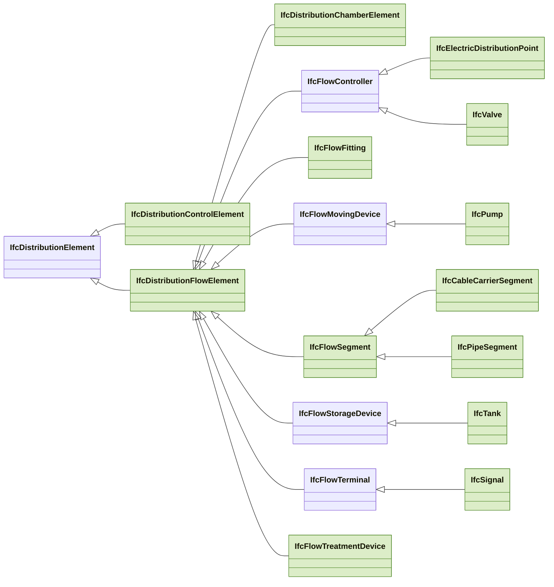
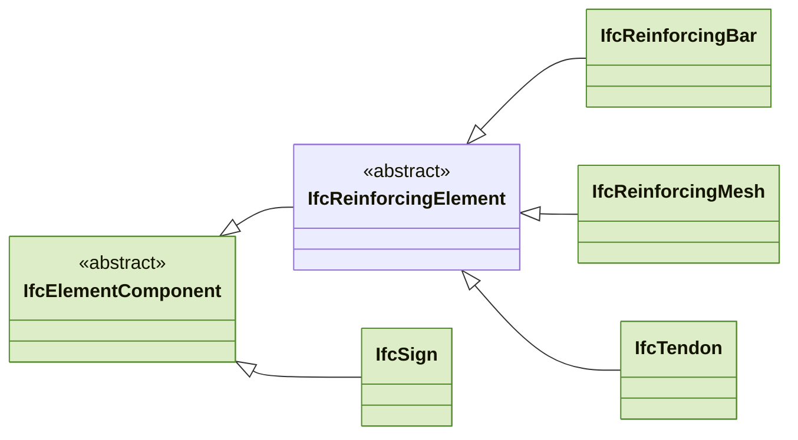
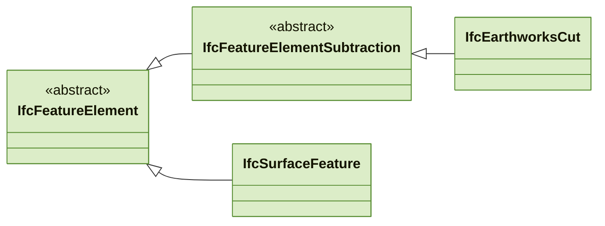
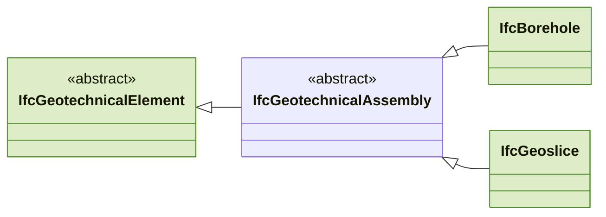
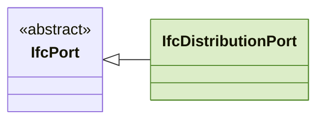
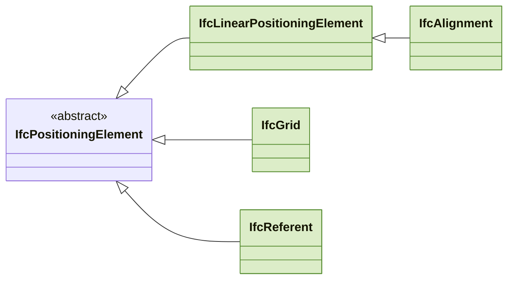
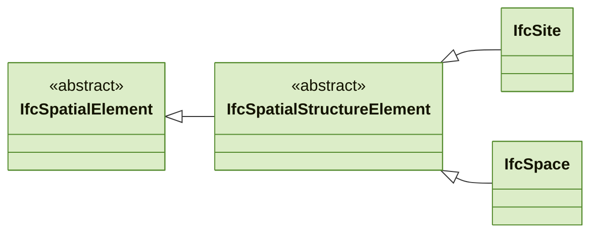
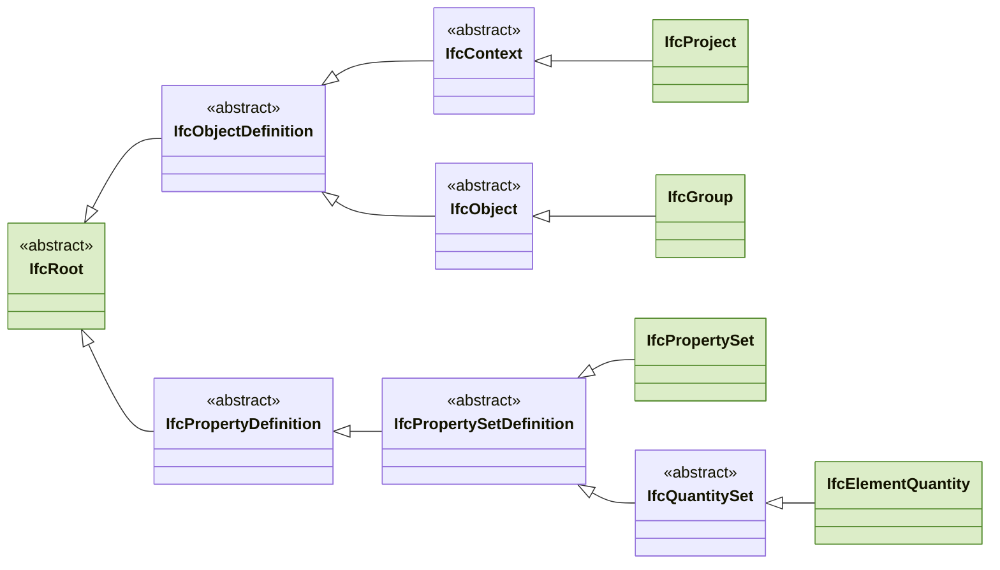

# Genutzte IFC-Klassen

> Erzeugt von `backend/app/ifc/diagramme.py` aus dem Code und dem Schema-Schnappschuss (IFC4X3_ADD2, ifcopenshell 0.8.5). Nicht von Hand ändern — neu schreiben mit `cd backend && python3 -m app.ifc.diagramme`.

Grün: Klassen, die die CDE schreibt oder liest — wer, steht in der Tabelle. Die übrigen Knoten sind die Obertypen dazwischen; `<<abstract>>` lässt sich nicht instanziieren.

## Bauteile, Räume, Gelände (unter IfcProduct)

An welchen Ästen die genutzten Klassen hängen — darunter je Ast sein Baum. Ein Ast, der selbst die einzige genutzte Klasse ist, steht nur hier.

### IfcBuiltElement — 23 genutzt

### IfcDistributionElement — 13 genutzt

### IfcElementComponent — 5 genutzt

### IfcFeatureElement — 4 genutzt

### IfcGeotechnicalElement — 3 genutzt

### IfcPort — 1 genutzt

### IfcPositioningElement — 4 genutzt

### IfcSpatialElement — 4 genutzt

## Projekt, Gruppen, Merkmalsätze

Die Beziehungen stehen mit ihren Enden in [beziehungen.md](beziehungen.md).

## Alle genutzten Klassen unter IfcRoot

| Klasse | genutzt von | abstrakt | Schema |
|---|---|---|---|
| [IfcAlignment](https://ifc43-docs.standards.buildingsmart.org/IFC/RELEASE/IFC4x3/HTML/lexical/IfcAlignment.htm) | Typprofile | nein | IFC4X3_ADD2 |
| [IfcAnnotation](https://ifc43-docs.standards.buildingsmart.org/IFC/RELEASE/IFC4x3/HTML/lexical/IfcAnnotation.htm) | Bauteilrezepte, Eigenbau, Typprofile | nein | IFC4X3_ADD2 |
| [IfcBeam](https://ifc43-docs.standards.buildingsmart.org/IFC/RELEASE/IFC4x3/HTML/lexical/IfcBeam.htm) | Kategorien, Typprofile | nein | IFC4X3_ADD2 |
| [IfcBorehole](https://ifc43-docs.standards.buildingsmart.org/IFC/RELEASE/IFC4x3/HTML/lexical/IfcBorehole.htm) | Typprofile | nein | IFC4X3_ADD2 |
| [IfcBuildingElementProxy](https://ifc43-docs.standards.buildingsmart.org/IFC/RELEASE/IFC4x3/HTML/lexical/IfcBuildingElementProxy.htm) | Bauteilrezepte, Typprofile | nein | IFC4X3_ADD2 |
| [IfcBuiltElement](https://ifc43-docs.standards.buildingsmart.org/IFC/RELEASE/IFC4x3/HTML/lexical/IfcBuiltElement.htm) | Typprofile | nein | IFC4X3_ADD2 |
| [IfcCableCarrierSegment](https://ifc43-docs.standards.buildingsmart.org/IFC/RELEASE/IFC4x3/HTML/lexical/IfcCableCarrierSegment.htm) | Typprofile | nein | IFC4X3_ADD2 |
| [IfcCivilElement](https://ifc43-docs.standards.buildingsmart.org/IFC/RELEASE/IFC4x3/HTML/lexical/IfcCivilElement.htm) | Gelände, Typprofile | nein | IFC4X3_ADD2 (abgekündigt) |
| [IfcColumn](https://ifc43-docs.standards.buildingsmart.org/IFC/RELEASE/IFC4x3/HTML/lexical/IfcColumn.htm) | Typprofile | nein | IFC4X3_ADD2 |
| [IfcCourse](https://ifc43-docs.standards.buildingsmart.org/IFC/RELEASE/IFC4x3/HTML/lexical/IfcCourse.htm) | Typprofile | nein | IFC4X3_ADD2 |
| [IfcCovering](https://ifc43-docs.standards.buildingsmart.org/IFC/RELEASE/IFC4x3/HTML/lexical/IfcCovering.htm) | Typprofile | nein | IFC4X3_ADD2 |
| [IfcCurtainWall](https://ifc43-docs.standards.buildingsmart.org/IFC/RELEASE/IFC4x3/HTML/lexical/IfcCurtainWall.htm) | Typprofile | nein | IFC4X3_ADD2 |
| [IfcDistributionChamberElement](https://ifc43-docs.standards.buildingsmart.org/IFC/RELEASE/IFC4x3/HTML/lexical/IfcDistributionChamberElement.htm) | Bauteilrezepte, Kategorien, Typprofile | nein | IFC4X3_ADD2 |
| [IfcDistributionControlElement](https://ifc43-docs.standards.buildingsmart.org/IFC/RELEASE/IFC4x3/HTML/lexical/IfcDistributionControlElement.htm) | Typprofile | nein | IFC4X3_ADD2 |
| [IfcDistributionFlowElement](https://ifc43-docs.standards.buildingsmart.org/IFC/RELEASE/IFC4x3/HTML/lexical/IfcDistributionFlowElement.htm) | Typprofile | nein | IFC4X3_ADD2 |
| [IfcDistributionPort](https://ifc43-docs.standards.buildingsmart.org/IFC/RELEASE/IFC4x3/HTML/lexical/IfcDistributionPort.htm) | Typprofile | nein | IFC4X3_ADD2 |
| [IfcDoor](https://ifc43-docs.standards.buildingsmart.org/IFC/RELEASE/IFC4x3/HTML/lexical/IfcDoor.htm) | Typprofile | nein | IFC4X3_ADD2 |
| [IfcEarthworksCut](https://ifc43-docs.standards.buildingsmart.org/IFC/RELEASE/IFC4x3/HTML/lexical/IfcEarthworksCut.htm) | Eigenbau-Paket, Kategorien, Typprofile | nein | IFC4X3_ADD2 |
| [IfcEarthworksElement](https://ifc43-docs.standards.buildingsmart.org/IFC/RELEASE/IFC4x3/HTML/lexical/IfcEarthworksElement.htm) | Gelände, Typprofile | nein | IFC4X3_ADD2 |
| [IfcEarthworksFill](https://ifc43-docs.standards.buildingsmart.org/IFC/RELEASE/IFC4x3/HTML/lexical/IfcEarthworksFill.htm) | Eigenbau-Paket, Gelände, Typprofile | nein | IFC4X3_ADD2 |
| [IfcElectricDistributionPoint](https://standards.buildingsmart.org/IFC/RELEASE/IFC2x3/TC1/HTML/ifcelectricaldomain/lexical/ifcelectricdistributionpoint.htm) | Typprofile | nein | nur IFC2X3 |
| [IfcElectricalElement](https://standards.buildingsmart.org/IFC/RELEASE/IFC2x3/TC1/HTML/ifcproductextension/lexical/ifcelectricalelement.htm) | Typprofile | nein | nur IFC2X3 |
| [IfcElementComponent](https://ifc43-docs.standards.buildingsmart.org/IFC/RELEASE/IFC4x3/HTML/lexical/IfcElementComponent.htm) | Typprofile | ja | IFC4X3_ADD2 |
| [IfcElementQuantity](https://ifc43-docs.standards.buildingsmart.org/IFC/RELEASE/IFC4x3/HTML/lexical/IfcElementQuantity.htm) | Eigenbau | nein | IFC4X3_ADD2 |
| [IfcEquipmentElement](https://standards.buildingsmart.org/IFC/RELEASE/IFC2x3/TC1/HTML/ifcproductextension/lexical/ifcequipmentelement.htm) | Typprofile | nein | nur IFC2X3 |
| [IfcFeatureElement](https://ifc43-docs.standards.buildingsmart.org/IFC/RELEASE/IFC4x3/HTML/lexical/IfcFeatureElement.htm) | Eigenbau, Typprofile | ja | IFC4X3_ADD2 |
| [IfcFeatureElementSubtraction](https://ifc43-docs.standards.buildingsmart.org/IFC/RELEASE/IFC4x3/HTML/lexical/IfcFeatureElementSubtraction.htm) | Eigenbau | ja | IFC4X3_ADD2 |
| [IfcFlowFitting](https://ifc43-docs.standards.buildingsmart.org/IFC/RELEASE/IFC4x3/HTML/lexical/IfcFlowFitting.htm) | Typprofile | nein | IFC4X3_ADD2 |
| [IfcFlowSegment](https://ifc43-docs.standards.buildingsmart.org/IFC/RELEASE/IFC4x3/HTML/lexical/IfcFlowSegment.htm) | Kategorien, Typprofile | nein | IFC4X3_ADD2 |
| [IfcFlowTreatmentDevice](https://ifc43-docs.standards.buildingsmart.org/IFC/RELEASE/IFC4x3/HTML/lexical/IfcFlowTreatmentDevice.htm) | Typprofile | nein | IFC4X3_ADD2 |
| [IfcFurnishingElement](https://ifc43-docs.standards.buildingsmart.org/IFC/RELEASE/IFC4x3/HTML/lexical/IfcFurnishingElement.htm) | Typprofile | nein | IFC4X3_ADD2 |
| [IfcGeographicElement](https://ifc43-docs.standards.buildingsmart.org/IFC/RELEASE/IFC4x3/HTML/lexical/IfcGeographicElement.htm) | Bauteilrezepte, Gelände, Typprofile | nein | IFC4X3_ADD2 |
| [IfcGeoslice](https://ifc43-docs.standards.buildingsmart.org/IFC/RELEASE/IFC4x3/HTML/lexical/IfcGeoslice.htm) | Typprofile | nein | IFC4X3_ADD2 |
| [IfcGeotechnicalElement](https://ifc43-docs.standards.buildingsmart.org/IFC/RELEASE/IFC4x3/HTML/lexical/IfcGeotechnicalElement.htm) | Typprofile | ja | IFC4X3_ADD2 |
| [IfcGrid](https://ifc43-docs.standards.buildingsmart.org/IFC/RELEASE/IFC4x3/HTML/lexical/IfcGrid.htm) | Typprofile | nein | IFC4X3_ADD2 |
| [IfcGroup](https://ifc43-docs.standards.buildingsmart.org/IFC/RELEASE/IFC4x3/HTML/lexical/IfcGroup.htm) | Eigenbau, Verbund | nein | IFC4X3_ADD2 |
| [IfcKerb](https://ifc43-docs.standards.buildingsmart.org/IFC/RELEASE/IFC4x3/HTML/lexical/IfcKerb.htm) | Kategorien, Typprofile | nein | IFC4X3_ADD2 |
| [IfcLinearElement](https://ifc43-docs.standards.buildingsmart.org/IFC/RELEASE/IFC4x3/HTML/lexical/IfcLinearElement.htm) | Typprofile | nein | IFC4X3_ADD2 |
| [IfcLinearPositioningElement](https://ifc43-docs.standards.buildingsmart.org/IFC/RELEASE/IFC4x3/HTML/lexical/IfcLinearPositioningElement.htm) | Typprofile | nein | IFC4X3_ADD2 |
| [IfcMember](https://ifc43-docs.standards.buildingsmart.org/IFC/RELEASE/IFC4x3/HTML/lexical/IfcMember.htm) | Kategorien, Typprofile | nein | IFC4X3_ADD2 |
| [IfcNavigationElement](https://ifc43-docs.standards.buildingsmart.org/IFC/RELEASE/IFC4x3/HTML/lexical/IfcNavigationElement.htm) | Typprofile | nein | IFC4X3_ADD2 |
| [IfcPavement](https://ifc43-docs.standards.buildingsmart.org/IFC/RELEASE/IFC4x3/HTML/lexical/IfcPavement.htm) | Typprofile | nein | IFC4X3_ADD2 |
| [IfcPile](https://ifc43-docs.standards.buildingsmart.org/IFC/RELEASE/IFC4x3/HTML/lexical/IfcPile.htm) | Typprofile | nein | IFC4X3_ADD2 |
| [IfcPipeSegment](https://ifc43-docs.standards.buildingsmart.org/IFC/RELEASE/IFC4x3/HTML/lexical/IfcPipeSegment.htm) | Bauteilrezepte, Typprofile | nein | IFC4X3_ADD2 |
| [IfcPlate](https://ifc43-docs.standards.buildingsmart.org/IFC/RELEASE/IFC4x3/HTML/lexical/IfcPlate.htm) | Typprofile | nein | IFC4X3_ADD2 |
| [IfcProduct](https://ifc43-docs.standards.buildingsmart.org/IFC/RELEASE/IFC4x3/HTML/lexical/IfcProduct.htm) | Verbund | ja | IFC4X3_ADD2 |
| [IfcProject](https://ifc43-docs.standards.buildingsmart.org/IFC/RELEASE/IFC4x3/HTML/lexical/IfcProject.htm) | Verbund | nein | IFC4X3_ADD2 |
| [IfcPropertySet](https://ifc43-docs.standards.buildingsmart.org/IFC/RELEASE/IFC4x3/HTML/lexical/IfcPropertySet.htm) | Eigenbau, Herkunft, Verbund | nein | IFC4X3_ADD2 |
| [IfcProxy](https://standards.buildingsmart.org/IFC/RELEASE/IFC4/ADD2_TC1/HTML/schema/ifckernel/lexical/ifcproxy.htm) | Typprofile | nein | nur IFC2X3, IFC4 |
| [IfcPump](https://ifc43-docs.standards.buildingsmart.org/IFC/RELEASE/IFC4x3/HTML/lexical/IfcPump.htm) | Typprofile | nein | IFC4X3_ADD2 |
| [IfcRail](https://ifc43-docs.standards.buildingsmart.org/IFC/RELEASE/IFC4x3/HTML/lexical/IfcRail.htm) | Typprofile | nein | IFC4X3_ADD2 |
| [IfcRailing](https://ifc43-docs.standards.buildingsmart.org/IFC/RELEASE/IFC4x3/HTML/lexical/IfcRailing.htm) | Typprofile | nein | IFC4X3_ADD2 |
| [IfcReferent](https://ifc43-docs.standards.buildingsmart.org/IFC/RELEASE/IFC4x3/HTML/lexical/IfcReferent.htm) | Typprofile | nein | IFC4X3_ADD2 |
| [IfcReinforcingBar](https://ifc43-docs.standards.buildingsmart.org/IFC/RELEASE/IFC4x3/HTML/lexical/IfcReinforcingBar.htm) | Typprofile | nein | IFC4X3_ADD2 |
| [IfcReinforcingMesh](https://ifc43-docs.standards.buildingsmart.org/IFC/RELEASE/IFC4x3/HTML/lexical/IfcReinforcingMesh.htm) | Typprofile | nein | IFC4X3_ADD2 |
| [IfcRelAggregates](https://ifc43-docs.standards.buildingsmart.org/IFC/RELEASE/IFC4x3/HTML/lexical/IfcRelAggregates.htm) | Verbund | nein | IFC4X3_ADD2 |
| [IfcRelAssignsToGroup](https://ifc43-docs.standards.buildingsmart.org/IFC/RELEASE/IFC4x3/HTML/lexical/IfcRelAssignsToGroup.htm) | Eigenbau, Verbund | nein | IFC4X3_ADD2 |
| [IfcRelAssociatesDocument](https://ifc43-docs.standards.buildingsmart.org/IFC/RELEASE/IFC4x3/HTML/lexical/IfcRelAssociatesDocument.htm) | Herkunft | nein | IFC4X3_ADD2 |
| [IfcRelContainedInSpatialStructure](https://ifc43-docs.standards.buildingsmart.org/IFC/RELEASE/IFC4x3/HTML/lexical/IfcRelContainedInSpatialStructure.htm) | Eigenbau | nein | IFC4X3_ADD2 |
| [IfcRelDefinesByProperties](https://ifc43-docs.standards.buildingsmart.org/IFC/RELEASE/IFC4x3/HTML/lexical/IfcRelDefinesByProperties.htm) | Eigenbau, Herkunft, Verbund | nein | IFC4X3_ADD2 |
| [IfcRelVoidsElement](https://ifc43-docs.standards.buildingsmart.org/IFC/RELEASE/IFC4x3/HTML/lexical/IfcRelVoidsElement.htm) | Eigenbau | nein | IFC4X3_ADD2 |
| [IfcRelationship](https://ifc43-docs.standards.buildingsmart.org/IFC/RELEASE/IFC4x3/HTML/lexical/IfcRelationship.htm) | Verbund | ja | IFC4X3_ADD2 |
| [IfcRoof](https://ifc43-docs.standards.buildingsmart.org/IFC/RELEASE/IFC4x3/HTML/lexical/IfcRoof.htm) | Typprofile | nein | IFC4X3_ADD2 |
| [IfcRoot](https://ifc43-docs.standards.buildingsmart.org/IFC/RELEASE/IFC4x3/HTML/lexical/IfcRoot.htm) | Verbund | ja | IFC4X3_ADD2 |
| [IfcShadingDevice](https://ifc43-docs.standards.buildingsmart.org/IFC/RELEASE/IFC4x3/HTML/lexical/IfcShadingDevice.htm) | Typprofile | nein | IFC4X3_ADD2 |
| [IfcSign](https://ifc43-docs.standards.buildingsmart.org/IFC/RELEASE/IFC4x3/HTML/lexical/IfcSign.htm) | Typprofile | nein | IFC4X3_ADD2 |
| [IfcSignal](https://ifc43-docs.standards.buildingsmart.org/IFC/RELEASE/IFC4x3/HTML/lexical/IfcSignal.htm) | Typprofile | nein | IFC4X3_ADD2 |
| [IfcSite](https://ifc43-docs.standards.buildingsmart.org/IFC/RELEASE/IFC4x3/HTML/lexical/IfcSite.htm) | Verbund | nein | IFC4X3_ADD2 |
| [IfcSlab](https://ifc43-docs.standards.buildingsmart.org/IFC/RELEASE/IFC4x3/HTML/lexical/IfcSlab.htm) | Typprofile | nein | IFC4X3_ADD2 |
| [IfcSpace](https://ifc43-docs.standards.buildingsmart.org/IFC/RELEASE/IFC4x3/HTML/lexical/IfcSpace.htm) | Typprofile | nein | IFC4X3_ADD2 |
| [IfcSpatialElement](https://ifc43-docs.standards.buildingsmart.org/IFC/RELEASE/IFC4x3/HTML/lexical/IfcSpatialElement.htm) | Verbund | ja | IFC4X3_ADD2 |
| [IfcSpatialStructureElement](https://ifc43-docs.standards.buildingsmart.org/IFC/RELEASE/IFC4x3/HTML/lexical/IfcSpatialStructureElement.htm) | Verbund | ja | IFC4X3_ADD2 |
| [IfcSurfaceFeature](https://ifc43-docs.standards.buildingsmart.org/IFC/RELEASE/IFC4x3/HTML/lexical/IfcSurfaceFeature.htm) | Typprofile | nein | IFC4X3_ADD2 |
| [IfcTank](https://ifc43-docs.standards.buildingsmart.org/IFC/RELEASE/IFC4x3/HTML/lexical/IfcTank.htm) | Typprofile | nein | IFC4X3_ADD2 |
| [IfcTendon](https://ifc43-docs.standards.buildingsmart.org/IFC/RELEASE/IFC4x3/HTML/lexical/IfcTendon.htm) | Typprofile | nein | IFC4X3_ADD2 |
| [IfcTransportationDevice](https://ifc43-docs.standards.buildingsmart.org/IFC/RELEASE/IFC4x3/HTML/lexical/IfcTransportationDevice.htm) | Typprofile | ja | IFC4X3_ADD2 |
| [IfcValve](https://ifc43-docs.standards.buildingsmart.org/IFC/RELEASE/IFC4x3/HTML/lexical/IfcValve.htm) | Typprofile | nein | IFC4X3_ADD2 |
| [IfcVirtualElement](https://ifc43-docs.standards.buildingsmart.org/IFC/RELEASE/IFC4x3/HTML/lexical/IfcVirtualElement.htm) | Typprofile | nein | IFC4X3_ADD2 |
| [IfcWall](https://ifc43-docs.standards.buildingsmart.org/IFC/RELEASE/IFC4x3/HTML/lexical/IfcWall.htm) | Typprofile | nein | IFC4X3_ADD2 |
| [IfcWindow](https://ifc43-docs.standards.buildingsmart.org/IFC/RELEASE/IFC4x3/HTML/lexical/IfcWindow.htm) | Typprofile | nein | IFC4X3_ADD2 |

## Ressourcen (nicht unter IfcRoot)

Geometrie, Einheiten, Werte, Stile — ohne GlobalId, deshalb nicht im Baum oben.

| Klasse | genutzt von |
|---|---|
| IfcApplication | Verbund |
| IfcAxis2Placement3D | Eigenbau, Verbund |
| IfcCartesianPoint | Eigenbau, Verbund |
| IfcCartesianPointList3D | Eigenbau, Verbund |
| IfcColourRgb | Eigenbau |
| IfcDirection | Verbund |
| IfcDocumentInformation | Herkunft, Verbund |
| IfcDocumentReference | Herkunft, Verbund |
| IfcGeometricRepresentationContext | Verbund |
| IfcGeometricRepresentationSubContext | Eigenbau, Verbund |
| IfcIndexedPolyCurve | Eigenbau |
| IfcLocalPlacement | Eigenbau, Verbund |
| IfcMapConversion | Verbund |
| IfcOrganization | Verbund |
| IfcOwnerHistory | Eigenbau, Verbund |
| IfcPerson | Verbund |
| IfcPersonAndOrganization | Verbund |
| IfcPresentationLayerAssignment | Verbund |
| IfcProductDefinitionShape | Eigenbau |
| IfcProjectedCRS | Verbund |
| IfcPropertySingleValue | Eigenbau, Herkunft, Verbund |
| IfcQuantityArea | Eigenbau |
| IfcQuantityCount | Eigenbau |
| IfcQuantityLength | Eigenbau |
| IfcQuantityVolume | Eigenbau |
| IfcQuantityWeight | Eigenbau |
| IfcRepresentation | Verbund |
| IfcSIUnit | Verbund |
| IfcShapeRepresentation | Eigenbau |
| IfcStyledItem | Eigenbau, Verbund |
| IfcSurfaceStyle | Eigenbau |
| IfcSurfaceStyleShading | Eigenbau |
| IfcTriangulatedFaceSet | Eigenbau |
| IfcUnitAssignment | Verbund |

Im Code genannt, aber keine Klasse des Schnappschusses — Datentypen oder Klassen älterer Schemata, die ADD2 nicht mehr führt (9): `IfcBoolean`, `IfcDateTime`, `IfcIdentifier`, `IfcInteger`, `IfcLabel`, `IfcPresentationStyleAssignment`, `IfcReal`, `IfcText`, `IfcVolumeMeasure`.
