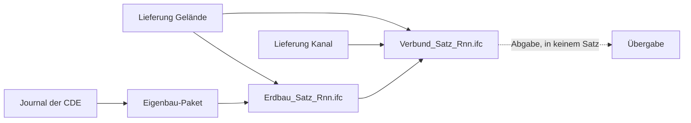

# Fachmodelle und erzeugte Container

Handgeschrieben — die übrigen Dateien in diesem Ordner erzeugt
`backend/app/ifc/diagramme.py`. Stand 2026-09-11, Fahrplan „Abgeleitete
Erdbau-Container in der CDE".

## Leitsatz

**Föderiert, nicht gemergt** (ISO 19650): jeder Beteiligte — und jeder erzeugende
Prozess der CDE — liefert seinen EIGENEN Container. Quellen werden nie verändert.
Der Verbund ist ein Abgabe-Artefakt, aus den Quellen jederzeit neu baubar.

## Drei Sorten Container

| Container | entsteht | darf in einen Satz | Herkunft |
|---|---|---|---|
| Lieferung | Upload eines Beteiligten | ja | keine — woher sie kam, weiß der Planer |
| Erdbau-Dokument (`Erdbau_<Satz>_R<nn>.ifc`) | Unterprozess, Modus `erdbau`: Gelände der Wirte + Eigenbau | ja — es IST das Fachmodell Erdbau | Manifest `herkunft`, `Quagg_Herkunft` je Element, Dokumentverweise |
| Verbund (`Verbund_<Satz>_R<nn>.ifc`) | Unterprozess, Modus `verbund`: der Satz | **nein** (E1) | Manifest `herkunft`, Fachmodell-Gruppen, Dokumentverweise |

## Entscheidungen (Fabio, 2026-09-11)

- **E1** Der Verbund bleibt Registerdokument, gehört aber in keinen Modellsatz (`cde._satz_pruefen`).
- **E2** Homogenbereiche (DIN 18300, `IfcClassificationReference`) und ICDD (ISO 21597): später.
- **E3** Eine Namensregel nur für erzeugte Container (`cde.ERZEUGT_MUSTER`), dazu die Eignung (S1–S4, A1, CR) als Metadatum im Register.
- **E4** GlobalIds bleiben an der Journal-Kennung — Objektidentität über Revisionen. Ob sich der Inhalt änderte, sagt `Quagg_Herkunft.EingabeHash`.
- **E5** EIN Merkmalssatz `Quagg_Herkunft` je erzeugtem Element, geschrieben von EINEM Helfer (`backend/app/ifc/herkunft.py`); Präfix `Quagg_`, weil `Pset_` bSI vorbehalten ist.

## Was ein fremdes Werkzeug am Aushub liest

`Quagg_CDE` (Journal-Kennung, Rezept, Wirt) und `Quagg_Herkunft` (Quelldokument,
Revision, sha256, Quell-GlobalIds, Journalstand, Zeitpunkt, Werkzeug,
Eingabe-Hash), dazu die Quelle als `IfcDocumentReference` → `IfcDocumentInformation`
über `IfcRelAssociatesDocument`. Die Regeln `spec-aushub-herkunft` und
`spec-aushub-typ` der Starter-IDS prüfen das — sobald sie als Regelwerk im Büro
oder im Projekt liegt.

## Grenzen

- Der Wirt eines Aushubs lässt sich per IDS nicht prüfen: ifctester 0.8.5 kennt
  `partOf IFCRELVOIDSELEMENT` nur für IfcOpeningElement. V07 im Prüftor misst ihn.
- IDS-Befunde sperren nicht (Schwere „warnung" im Bericht). Gesperrt wird durch
  das Prüftor: Schema, Verbundregeln, V10 (unvollständiger Eigenbau).
- Die Starter-IDS gilt nicht von selbst — sie muss als Regelwerk hochgeladen werden.
