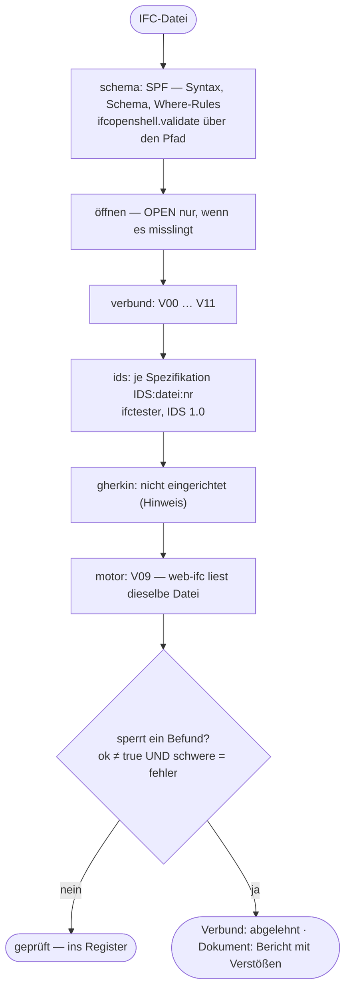

# Die Stufen des Prüftors

> Erzeugt von `backend/app/ifc/diagramme.py` aus dem Code und dem Schema-Schnappschuss (IFC4X3_ADD2, ifcopenshell 0.8.5). Nicht von Hand ändern — neu schreiben mit `cd backend && python3 -m app.ifc.diagramme`.

Ein Prüftor (`backend/app/ifc/pruefe.py`), fünf Stufen, eine Sperr-Regel. Ein Registerdokument (Modus `pruefe`) und ein Verbund gehen durch dasselbe Tor; bei einer einzelnen Lieferung melden die Verbundregeln nur.

`ok = None` heißt ungeprüft — und ungeprüft gilt als nicht bestanden. Die Regel steht einmal: `pruefe.offen`, im Client gespiegelt in `services/Pruefbericht.js`.

| Kennung | Stufe | Titel | Schwere |
|---|---|---|---|
| SPF | schema | SPF-Syntax, EXPRESS-Schema und Where-Rules | Fehler |
| OPEN | schema | Datei laesst sich oeffnen | Fehler |
| V00 | verbund | Schema ist IFC4X3_ADD2 | Fehler im Verbund, Warnung bei einer einzelnen Lieferung |
| V01 | verbund | genau ein IfcProject | Fehler |
| V02 | verbund | eine Einheitenzuweisung, Laenge in Metern | Fehler im Verbund, Warnung bei einer einzelnen Lieferung |
| V03 | verbund | ein Wurzelkontext, jede Darstellung zeigt hinein | Fehler im Verbund, Warnung bei einer einzelnen Lieferung |
| V04 | verbund | GlobalIds eindeutig und formgerecht (22 Zeichen, erstes 0-3) | Fehler |
| V05 | verbund | genau eine Raumwurzel unter dem Projekt | Fehler im Verbund, Warnung bei einer einzelnen Lieferung |
| V06a | verbund | Georeferenzierung vorhanden (CRS + MapConversion) | Fehler im Verbund, Warnung bei einer einzelnen Lieferung |
| V06b | verbund | groesste Koordinate liegt im Fenster des Bezugssystems | Fehler im Verbund, Warnung bei einer einzelnen Lieferung |
| V07 | verbund | jedes Bauteil haengt in der Raumgliederung (Aussparungen ueber ihren Wirt) | Fehler im Verbund, Warnung bei einer einzelnen Lieferung |
| V08 | verbund | jedes Bauteil traegt seine Herkunft (Fachmodell-Gruppe) | Fehler im Verbund, Warnung bei einer einzelnen Lieferung |
| V10 | verbund | Eigenbau vollstaendig — jedes Bauteil des Journals ist gebaut | Fehler |
| V11 | verbund | Eigenbau: Leeres und Ausgeblendetes | Hinweis |
| IDS | ids | Projektanforderungen (IDS 1.0) | Warnung je verfehlter Spezifikation; Hinweis, wenn keine IDS hinterlegt ist |
| GHERKIN | gherkin | Normative Regeln (buildingSMART Implementer Agreements) | Hinweis |
| V09 | motor | zweiter Motor (web-ifc) sieht dasselbe | Fehler |
